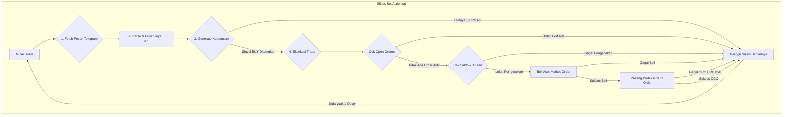

# Auto Trade Bot dari Sinyal Telegram

Bot ini dirancang untuk mengotomatiskan proses trading di Binance berdasarkan sinyal yang dikirim ke channel atau grup Telegram. Bot akan mengambil pesan, mem-parsingnya untuk menemukan sinyal trading, membuat keputusan berdasarkan kondisi pasar saat ini, dan mengeksekusi trade secara aman menggunakan order OCO (One-Cancels-the-Other).

## ✨ Fitur Utama

-   **Parser Telegram Canggih**: Mampu membedakan berbagai jenis pesan seperti sinyal baru, pembaruan sinyal, rekap harian, dan peringatan pasar.
-   **Keputusan Trading Dinamis**: Bot akan memeriksa harga pasar saat ini dan aturan trading (seperti nilai order minimum) sebelum memutuskan untuk membeli.
-   **Manajemen Posisi Aman**: Secara otomatis memeriksa apakah sudah ada posisi atau order aktif untuk sebuah koin sebelum membuka posisi baru, mencegah *double-buy*.
-   **Eksekusi Order OCO**: Setelah berhasil membeli aset, bot akan langsung memasang order OCO untuk *Take Profit* (TP) dan *Stop Loss* (SL) secara bersamaan, memastikan setiap trade terproteksi.
-   **Struktur Modular & Clean Code**: Dibuat dengan prinsip PPL, memisahkan logika Telegram, Binance, dan *core* aplikasi agar mudah dikelola dan dikembangkan.
-   **Mode Otomatis (Autoloop)**: Dapat berjalan secara terus-menerus dalam siklus untuk memantau sinyal dan trading secara mandiri selama durasi yang ditentukan atau selamanya.
-   **Pusat Kendali Terpusat**: Semua aksi bot dikontrol melalui satu file `main.py`, membuatnya mudah dioperasikan.

## 📂 Struktur Proyek

```
Telegram-Trading-Bot/
├── core/
│   └── routines.py          # Logika utama untuk setiap alur kerja (fetch, decide, dll.)
├── binance/
│   ├── client.py            # Klien untuk interaksi dengan API Binance
│   ├── trader.py            # Logika untuk eksekusi trade (buy, oco)
│   └── account.py           # Logika untuk manajemen akun (cek saldo, dll)
├── telegram/
│   ├── client.py            # Klien untuk koneksi dan mengambil pesan Telegram
│   ├── parser.py            # Logika untuk mem-parsing berbagai jenis pesan
│   └── __init__.py
├── data/                    # Direktori untuk semua output file .json
│   ├── new_signals.json     # Hasil parsing sinyal baru
│   ├── trade_decisions.json # Keputusan trading yang dibuat
│   └── trade_results.json   # Hasil eksekusi trading
├── main.py                  # File utama sebagai pusat kendali (entry point)
├── config.py                # Memuat konfigurasi dari file .env
├── requirements.txt         # Daftar library yang dibutuhkan
├── .env                     # File konfigurasi environment (tidak di-commit)
└── README.md                # File dokumentasi ini
```

## 🚀 Pengaturan & Instalasi

1.  **Clone Proyek**
    ```bash
    git clone <url_repository_anda>
    cd Telegram-Trading-Bot
    ```

2.  **Buat Virtual Environment** (Sangat disarankan)
    ```bash
    python -m venv venv
    source venv/bin/activate  # Di Windows: venv\Scripts\activate
    ```

3.  **Install Dependensi**
    ```bash
    pip install -r requirements.txt
    ```

4.  **Konfigurasi Environment**
    Buat file baru bernama `.env` di *root folder* dan isi dengan format berikut. Ganti nilainya dengan data Anda.

    ```env
    # Konfigurasi Telegram
    TELEGRAM_API_ID="YOUR_TELEGRAM_API_ID"
    TELEGRAM_API_HASH="YOUR_TELEGRAM_API_HASH"
    TELEGRAM_PHONE_NUMBER="YOUR_PHONE_NUMBER_WITH_COUNTRY_CODE"
    TELEGRAM_TARGET_CHAT_ID="TARGET_TELEGRAM_CHAT_ID"

    # Konfigurasi Binance
    BINANCE_API_KEY="YOUR_BINANCE_API_KEY"
    BINANCE_API_SECRET="YOUR_BINANCE_SECRET_KEY"

    # Konfigurasi Trading
    USDT_AMOUNT_PER_TRADE="11"
    ```

## 🛠️ Cara Penggunaan

Semua perintah dijalankan melalui `main.py`.

-   **Mengambil Pesan dari Telegram**  
    (Akan mengambil 50 pesan terakhir secara default)
    ```bash
    python main.py fetch
    ```
    (Mengambil 100 pesan terakhir)
    ```bash
    python main.py fetch --limit 100
    ```

-   **Membuat Keputusan Trading**  
    (Membaca `new_signals.json` dan membuat `trade_decisions.json`)
    ```bash
    python main.py decide
    ```

-   **Mengeksekusi Trade**  
    (Membaca `trade_decisions.json` dan mengeksekusi sinyal `BUY`)
    ```bash
    python main.py execute
    ```

-   **Memeriksa Status Akun & Transaksi Berjalan**
    ```bash
    python main.py status
    ```

-   **Menjalankan Mode Otomatis (Autoloop)**  
    (Berjalan selamanya, jeda 5 menit antar siklus, mengambil 50 pesan)
    ```bash
    python main.py autoloop
    ```
    (Berjalan selama 2 jam, jeda 10 menit, mengambil 20 pesan)
    ```bash
    python main.py autoloop --duration 120 --delay 600 --limit 20
    ```

-   **Menjalankan Seluruh Alur Sekali Jalan**  
    (Fetch -> Decide -> Execute)
    ```bash
    python main.py run-all
    ```

## 🌊 Diagram Alur Kerja Bot

Diagram di bawah ini mengilustrasikan alur kerja utama bot saat berjalan dalam mode `autoloop`.

